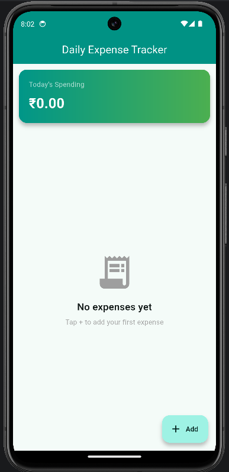
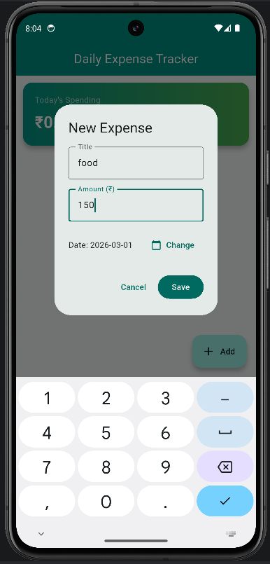
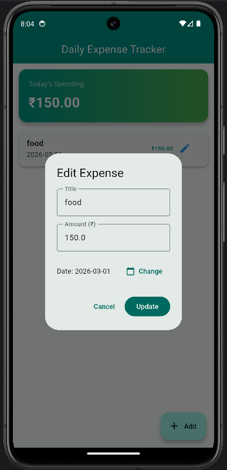
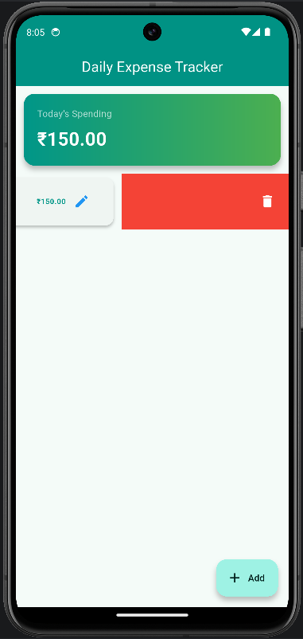

# Daily Expense Tracker

A Flutter application for tracking daily expenses using a local SQLite database.

---

## 🚀 Features

- Add new expenses
- Edit existing expenses
- Delete expenses (swipe to delete)
- View total daily spending
- Persistent local storage using SQLite
- Clean Material 3 UI
- Dark/Light theme support

---

## 🗄️ Database Used

This application uses **SQLite** via the `sqflite` package for local data persistence.

Each expense contains:
- id (Primary Key)
- title
- amount
- date

All CRUD (Create, Read, Update, Delete) operations are implemented using asynchronous database queries.

Data remains stored even after closing or restarting the app.

---

## 🛠️ Tech Stack

- Flutter
- Dart
- sqflite (SQLite)
- path package

---

## ▶️ How to Run

```bash
flutter pub get
flutter run

---

## 📱 Application Screenshots

### 🏠 Home Screen


### ➕ Add Expense


### ✏ Edit Expense


### 🗑 Delete Expense
