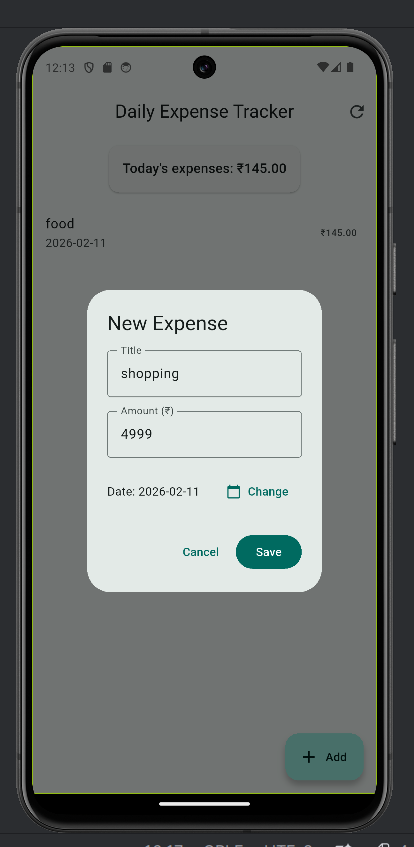
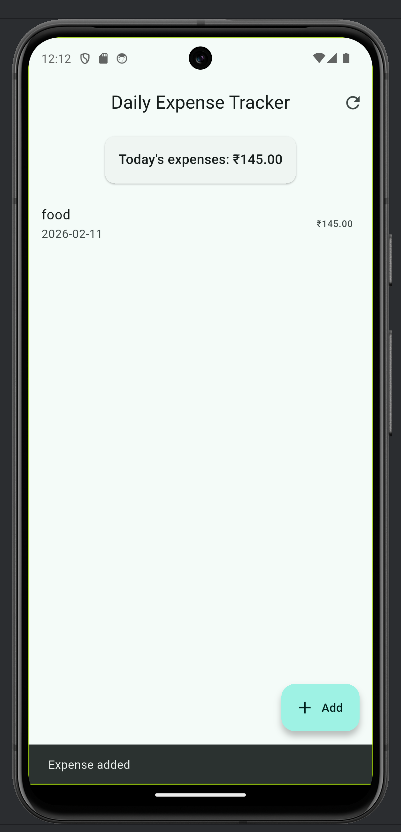
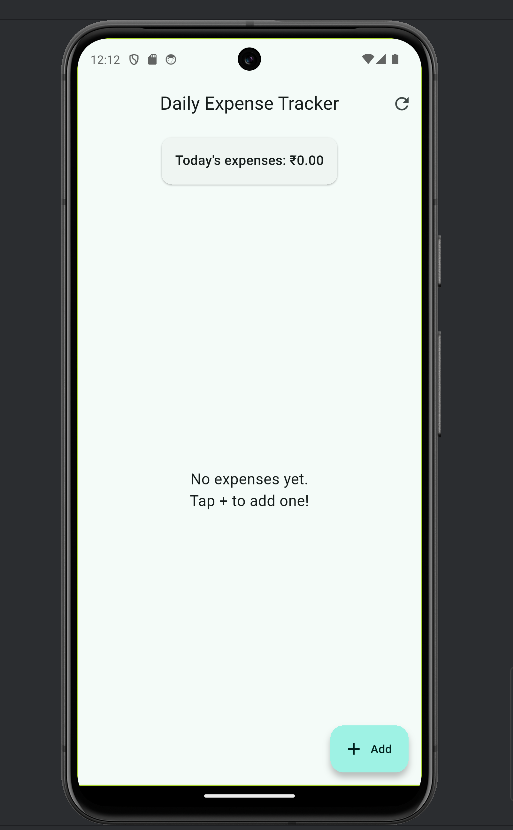

# Daily Expense Tracker

Flutter app that integrates a public REST API (DummyJSON), parses JSON, and displays data in ListView.

## Features
- Fetches products/expenses from API
- Shows list with title, amount, date
- Loading & error states
- Material 3 design

## API Used
https://dummyjson.com/products

## How to run
1. `flutter pub get`
2. `flutter run`

## Output Screenshots

### 1. Adding a new expense

### 2. Expense list after adding (with snackbar)

### 3. Empty state (no expenses yet)

